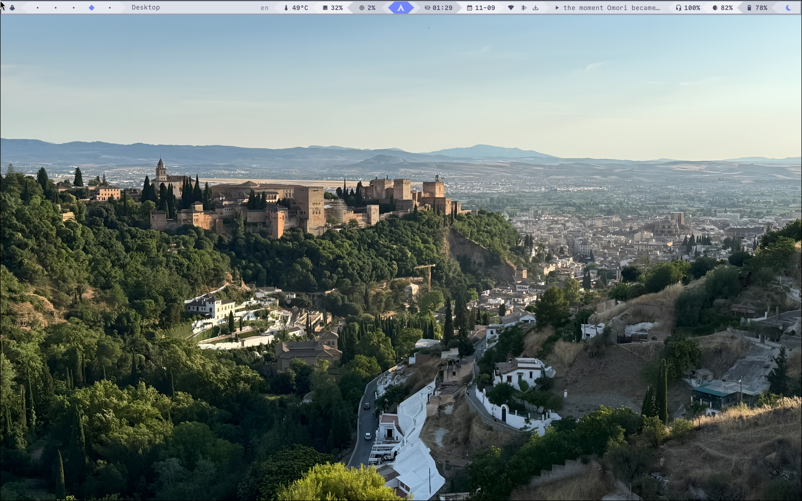
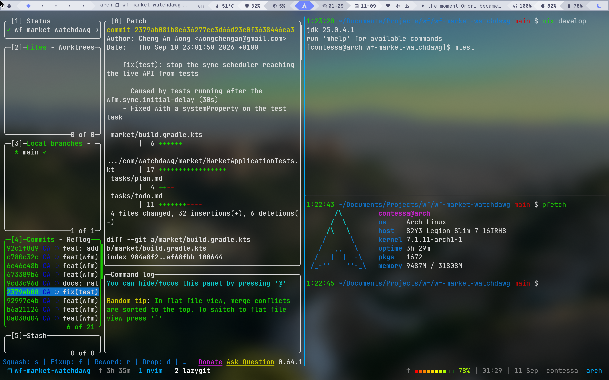

# archdots

dotfiles for my setup


| | |
|---|---|
| Compositor | [Hyprland](https://wiki.hyprland.org/)
| Bar | [Waybar](https://github.com/Alexays/Waybar) + [mechabar](https://github.com/sejjy/mechabar)
| Launcher | [fuzzel](https://codeberg.org/dnkl/fuzzel) + [cliphist](https://github.com/sentriz/cliphist) clipboard picker
| Notifications | [mako](https://mako-project.org)
| Wallpaper | [awww](https://codeberg.org/LGFae/awww) w/ picker script
| Terminal | [kitty](https://github.com/kovidgoyal/kitty)
| Shell | [zsh](https://wiki.archlinux.org/title/Zsh) + [zinit](https://github.com/zdharma-continuum/zinit) + [fzf-tab](https://github.com/Aloxaf/fzf-tab), autosuggestions, syntax-highlighting, [zoxide](https://github.com/ajeetdsouza/zoxide) as `cd`, [eza](https://github.com/eza-community/eza) as `ls` |
| Tmux | [tmux](https://github.com/tmux/tmux) + [oh-my-tmux](https://github.com/gpakosz/.tmux)
| Files | [yazi](https://github.com/sxyazi/yazi) w/ Dracula theme
| Lock / logout | [hyprlock](https://github.com/hyprwm/hyprlock) / [wlogout](https://github.com/ArtsyMacaw/wlogout)
| Screenshots | [grim](https://sr.ht/~emersion/grim) + [slurp](https://github.com/emersion/slurp)
| Login | [ly](https://codeberg.org/fairyglade/ly)
| GPU | [supergfxctl](https://wiki.archlinux.org/title/Supergfxctl) (hybrid mode, `nvidia-open`)
| Power | [TLP](https://linrunner.de/tlp/)
| Audio | [PipeWire](https://wiki.archlinux.org/title/PipeWire)
| Snapshots | [snapper](https://wiki.archlinux.org/title/Snapper) + [snap-pac](https://github.com/wesbarnett/snap-pac)
| Secure Boot | [sbctl](https://github.com/Foxboron/sbctl)

## Layout

```
hypr/ fuzzel/ kitty/ mako/ waybar/ wlogout/ yazi/   -> ~/.config/<name>   (symlinked)
.zshrc .zshenv .tmux.conf .tmux.conf.local          -> ~/                 (symlinked)
system/etc/...                                      -> /etc/...           (copied, see below)
pkg.list / aur.list                                 pacman -Qqen / -Qqem
hypr/scripts/                                       wallpaper picker, tmux pickers, screenshots, waybar auto-hide
```

## Install

Base system: follow the [Installation guide](https://wiki.archlinux.org/title/Installation_guide)

| Mountpoint | Type | Size |
|---|---|---|
| `/` | btrfs | 200G |
| `/home` | btrfs | 500G |
| `[SWAP]` | swap | 10G |
| `/boot` | FAT32 | 1G |

Then, as a normal user with [yay](https://github.com/Jguer/yay) installed:

```bash
git clone --recurse-submodules <this-repo> ~/Documents/Archdots/archdots
cd ~/Documents/Archdots/archdots

sudo pacman -S --needed - < pkg.list
yay -S --needed - < aur.list

# configs -> $HOME
for d in fuzzel hypr kitty mako waybar wlogout yazi; do ln -sfn "$PWD/$d" ~/.config/"$d"; done
ln -sf "$PWD"/.zshrc "$PWD"/.zshenv "$PWD"/.tmux.conf "$PWD"/.tmux.conf.local ~/

# /etc files (pacman hooks, snapshot config)
sudo ./system/install.sh
sudo systemctl enable --now snapper-cleanup.timer
```

Enable the usual services: `NetworkManager`, `ly@tty2`, `bluetooth`, `tlp`, `supergfxd`.

### `system/`

```bash
./system/install.sh          # repo -> /etc
./system/install.sh --pull   # /etc -> repo, after editing live
./system/install.sh --diff   # show drift
```

## Keybinds

With `SUPER` as mod key:

| | |
|---|---|
| `T` / `SHIFT T` | floating / tiled kitty |
| `A` · `V` | app launcher · clipboard history |
| `E` | yazi |
| `C` / `SHIFT C` | new tmux session · session picker |
| `W` | wallpaper picker |
| `Q` · `SHIFT Q` | close · force kill |
| `F` · `SHIFT F` | float · fullscreen |
| `H J K L` | move focus |
| `1`–`0` · `SHIFT 1`–`0` | workspace · move window there |
| `BACKSPACE` | wlogout |

Shell: `t` session picker, `tt` new session, `thelp` tmux cheatsheet, `ff` fastfetch, `ll`/`l` eza.
tmux prefix is `C-b` or `C-a`; `<prefix> ?` lists everything.
